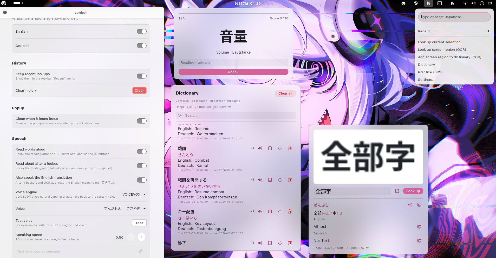
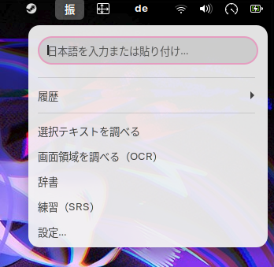
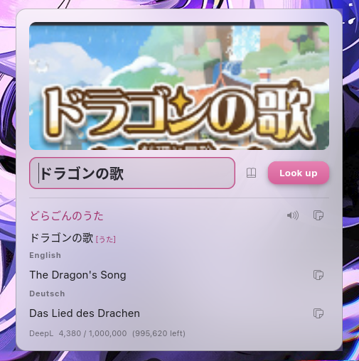
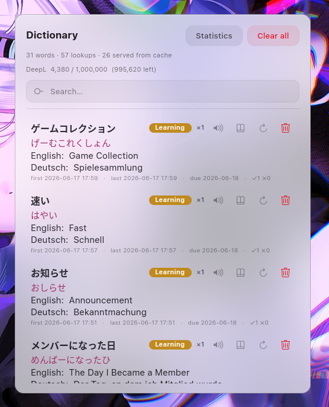
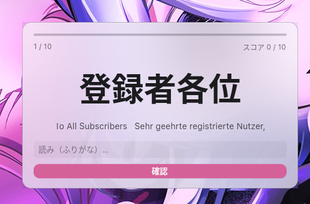
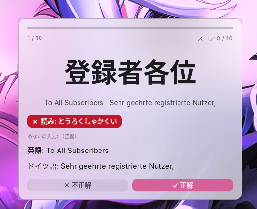
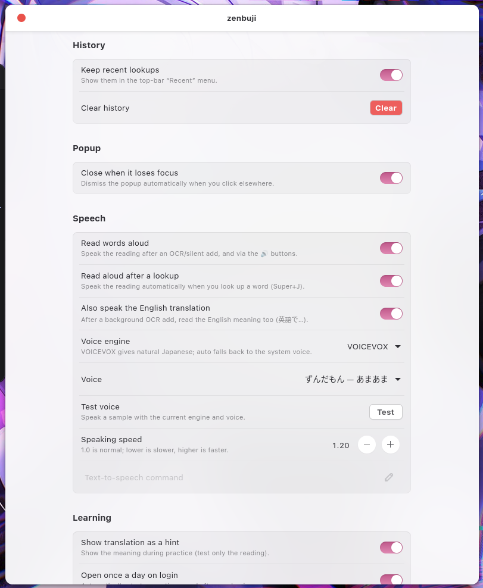
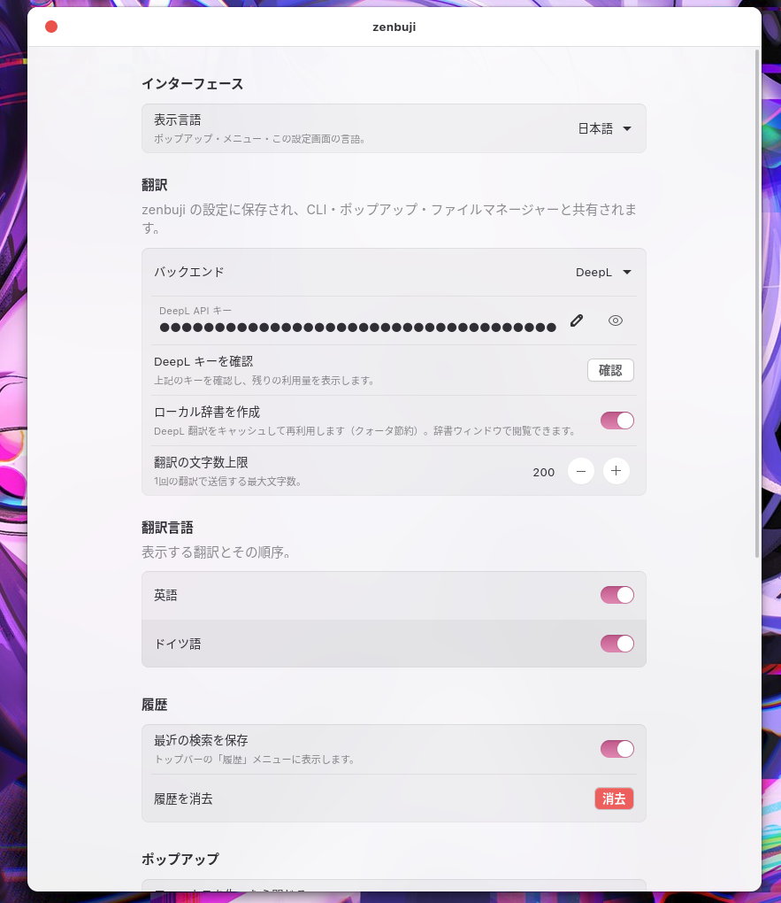
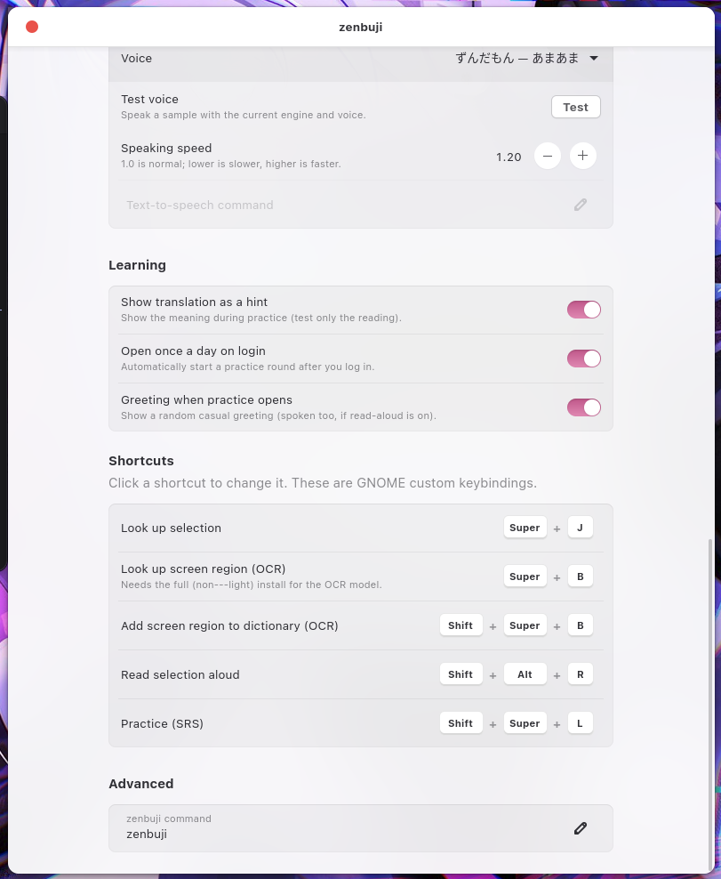

<div align="center">

# zenbuji 〜 全部字

### Read *any* Japanese on your screen — furigana + English & German — in one keypress

Highlight some text, mash `Super+J`, and *boom* — readings and meaning pop up right over
whatever you're doing. No alt-tabbing into a dictionary app, no breaking immersion in the
middle of an episode. Works in your browser, your editor, a chat window — and even on text
you *can't* select, because screen OCR has your back. (｡•̀ᴗ-)✧



<sub>Furigana from real word-level analysis (not lazy kana-by-kana guessing) · translation is offline-first · everything runs on your own machine.</sub>

</div>

---

## See it in action

Highlight Japanese in **any** app, hit the hotkey, read it. That's the whole loop — that's the magic:

```text
$ zenbuji 日本語を勉強しています
日本語を勉強しています
  にほんごをべんきょうしています
  日本語（にほんご） 勉強（べんきょう）

English: I am studying Japanese.
German: Ich lerne Japanisch.
```

---

## Why you'll love it

- **One keypress, anywhere.** A global GNOME shortcut grabs your selection and floats a popup over whatever app you're in. No context-switching, no killing the vibe.
- **Furigana that's actually *right*.** Readings come from real morphological analysis ([fugashi] + [unidic-lite]), so compounds and sneaky irregular readings come out correct — not a character-by-character guess that falls apart on 今日.
- **English *and* German, side by side.** Offline-first with [Argos Translate]; drop in a free [DeepL] key when you want the sharper translations.
- **OCR for text you can't select.** Subs burned into a video, a game UI, a screenshot, manga raws — draw a box and zenbuji reads it anyway.
- **Builds your own little dictionary.** Every DeepL lookup gets cached into a searchable word list, so you stop burning quota and start watching your vocab pile up.
- **Turns lookups into reps.** A built-in spaced-repetition quiz drills the words you've already met. Immersion → SRS → flex, no extra Anki deck required.
- **Hear every word.** A read-aloud button on every reading, with proper [VOICEVOX] support so it's natural neural Japanese instead of robot voice (falls back to the system voice if you skip it).
- **Genuinely pretty.** A frosted-glass popup that picks up your accent color and light/dark theme. Cute *and* functional ‹3
- **Yours, offline, private.** Everything's local — DeepL is the only optional network call. Runs happily on immutable distros (Bazzite / Silverblue) with zero `rpm-ostree` layering.

---

## Five ways to look something up

zenbuji meets you wherever the text is:

| Surface | How | What you get |
|---|---|---|
| **Global hotkey** | Select text, press `Super+J` | Popup with furigana + EN/DE over the current app |
| **Screen OCR** | `Super+Shift+J`, draw a box | Reads text you can't select, then looks it up |
| **Top-bar menu** | Click `振`, type or paste | Inline result, recent history, quick access to everything |
| **Files menu** | Right-click a text file ▸ *Scripts ▸ zenbuji* | Looks up a whole file |
| **CLI** | `zenbuji <text>` / pipe / `--selection` | Scriptable output (incl. `--json`) |

Under the hood all the language stuff lives in one `zenbuji` Python CLI — every surface just
calls it and renders the result, so they never drift out of sync. (One brain, many faces.)

<div align="center">

</div>

---

## Quick start

```sh
git clone git@github.com:Meeksi39/zenbuji.git ~/zenbuji
cd ~/zenbuji
./install.sh                 # CLI + extension + Nautilus + offline backend
./install.sh --models        # ...and download the offline models now
gnome-extensions enable zenbuji@meeksi39
```

On **Wayland you have to log out and back in** for GNOME to actually load the extension
(I know, I know — Wayland moment). The hotkey (`Super+J`) works right away, no logout needed.

**Lighter install** (no offline backend, ~300 MB instead of ~1.7 GB of models — just use DeepL):

```sh
./install.sh --light
zenbuji config --backend deepl --deepl-key <YOUR_DEEPL_KEY>
```

`install.sh` only ever touches `~/.local/bin/{zenbuji,zb}`, the extension dir, the Nautilus
script, and a venv at `~/.local/share/zenbuji/venv`. Your config in `~/.config/zenbuji/`
is never deleted — promise. Nuke everything with `./install.sh --uninstall`.

**Requirements:** GNOME Shell 45–50 on Wayland · `python3` with PyGObject + GTK 4 (already
there on GNOME) · `wl-clipboard` for selection lookup. On Bazzite/Silverblue the system
Python is immutable, so every dep lives in the venv (made with `--system-site-packages`) —
no layering, no reboots, no tears.

---

## Features

### Screen-region OCR

So much Japanese on screen just *isn't* selectable — text baked into a UI, a game, a video
frame, an image. Press **`Super+Shift+J`** (or top-bar ▸ *Look up screen region*), **draw a
box**, and zenbuji OCRs it and serves up furigana + EN/DE. It shows the captured image for
reference and drops the recognized text into an **editable field** — OCR isn't psychic, so
if it grabs a stray character just fix it and hit Enter to look it up again.

<div align="center">

</div>

OCR is [manga-ocr] (a lovely Japanese-tuned model) running **fully offline**. It needs the
full install (not `--light`) and grabs a ~450 MB model on first use; the very first lookup
takes a few seconds while the model wakes up (the popup shows a spinner). Capture goes
through the desktop Screenshot portal, so it's happy on Wayland.

```sh
zenbuji ocr                  # capture a region interactively
zenbuji ocr image.png        # or OCR a file you already have
```

### Personal dictionary

With the **DeepL** backend active, every translation gets cached to
`~/.local/share/zenbuji/dictionary.json`. Repeat lookups come straight from the cache —
faster, and it protects your free-tier quota — all while quietly building a personal word
list. Each entry tracks how many times you've looked it up and the first/last time you saw
it, so you can literally watch yourself level up.

Browse it in the **Dictionary window** (the dictionary button in the popup, the top-bar menu,
or `zenbuji dict`): search, delete an entry, clear all, re-translate, or pop a word back open
in the lookup popup. It also shows your remaining DeepL quota when a key is set.

<div align="center">

</div>

### Practice (spaced repetition)

Take the words you've already met and turn them into actual recall. **Practice**
(`zenbuji learn`, the **`Super+Shift+L`** hotkey, or the top-bar menu) shows a word as
**big chunky kanji** with no furigana; you type the **reading** (and the **translation**,
unless it's shown as a hint), then the answer is revealed and graded — the reading exactly,
the translation fuzzily (EN or DE) with a self-grade override (✓/✗) for when your wording
was *basically* right.

<div align="center">

| Type the reading… | …and get graded |
|:---:|:---:|
|  |  |

</div>

Results feed an SM-2-style schedule in `~/.local/share/zenbuji/srs.json`: nail it and the
next review drifts further out (New → Learning → Young → Mature), whiff it and the word
comes right back to haunt you. Each round pulls the most-due/new words (10 by default) and
ends with a little summary.

When the answer's revealed, the **Got it / Missed** default follows your *reading* — match it
and "Got it" is pre-selected, miss it and "Missed" is. The correct reading is read aloud too
(right or wrong) if you've got auto-read on. And every round opens with a random casual
greeting from ずんだもん — cute, silly, or a little bit cursed — which you can switch off.

- `--learn-show-translation on|off` — show the meaning as a hint (test only the reading) vs. hide it (test reading **and** translation)
- `--learn-on-login on|off` — auto-open a round once a day on login (off by default — opt in if you want the daily nudge)
- `--learn-greeting on|off` — the random opening greeting (on by default)

### Hear it spoken

Every reading gets a **read-aloud button** — in the popup, next to each dictionary entry,
and on the quiz answer screen — so you actually *hear* the pronunciation instead of just
squinting at kana.

For natural Japanese (and not the cursed robotic system voice), zenbuji has first-class
support for **[VOICEVOX]**, a free local neural TTS engine. One step to set it up:

```sh
./install.sh --voicevox   # pulls the engine (rootless podman) and runs it as a user service
```

Then pick a voice in **Settings ▸ Speech** (default: my beloved ずんだもん / Zundamon —
100+ voices to choose from) and smash **Test**. No VOICEVOX? zenbuji quietly falls back to
`spd-say`/`espeak-ng`. Engine and voice are configurable:
`zenbuji config --tts-engine voicevox --voicevox-speaker 3`, list voices with
`zenbuji voices`, or wire up any command you like with `--tts-command '… {text}'`.

<div align="center">



<em>Learn with ずんだもん！(◕ᴗ◕✿)</em>

</div>

Press **`Super+Shift+S`** to read the current selection aloud with no popup at all. Flip on
**Read aloud after a lookup** (Settings ▸ Speech, or `zenbuji config --tts-on-lookup on`) and
`Super+J` will speak the reading automatically every single time — perfect for shadowing.

### Frosted-glass popup

The popup is a headerless, translucent floating card that follows your light/dark theme and
**system accent color**, can be **dragged** from any empty spot, and dismisses on **Escape**
(and optionally when it loses focus). Every reading and translation has a **copy button**.

GNOME/Mutter can't blur behind an app's own window, so the real blur comes from
[Blur My Shell] — `install.sh` adds `com.meeksi39.zenbuji` to its **Applications ▸ whitelist**
automatically (idempotent, removed on uninstall). For peak prettiness: Applications blur
**on**, static blur **off**, hacks level **1+**. Without Blur My Shell it degrades gracefully
to a clean translucent panel, no drama.

---

## Usage (CLI)

```sh
zenbuji 日本語を勉強しています   # furigana + EN + DE
zenbuji furigana 今日は良い天気    # readings only
zenbuji tr これは何ですか          # translation only
zenbuji --selection               # process the current text selection
echo "ありがとう" | zenbuji        # from stdin
zenbuji --json 速い               # machine-readable output
zenbuji popup 速い                # GTK popup window
zenbuji ocr                       # capture a screen region and OCR it
zenbuji dict                      # open the local dictionary window
zenbuji learn                     # spaced-repetition practice over the cache
zenbuji speak こんにちは            # read text aloud (VOICEVOX / system voice)
zenbuji voices                    # list available VOICEVOX speakers
```

`zb` is a short alias for `zenbuji` (for when typing eight whole characters is too much).

### Re-binding the hotkey

`install.sh` registers `Super+J` as a GNOME *custom keyboard shortcut* running
`zenbuji popup --selection` (works even without the extension). Re-bind it under **Settings ▸
Keyboard ▸ Custom Shortcuts**, in the extension settings, or with gsettings:

```sh
P=org.gnome.settings-daemon.plugins.media-keys.custom-keybinding:/org/gnome/settings-daemon/plugins/media-keys/custom-keybindings/zenbuji/
gsettings set "$P" binding '<Super>F9'
```

### Configuration

Easiest path is the **extension settings UI** (`gnome-extensions prefs zenbuji@meeksi39`, or
*Extensions ▸ zenbuji ▸ Settings*): set the DeepL key, pick the backend and languages, choose
the interface language (English or 日本語), verify the key (shows remaining quota), toggle the
history, flip the popup's close-on-focus-loss, and rebind the hotkeys. It reads and writes the
same config file the CLI uses, so every surface stays in lockstep.

<div align="center">

| Translation & languages | Shortcuts & behaviour |
|:---:|:---:|
|  |  |

</div>

<details>
<summary><strong>Configure from the command line</strong></summary>

```sh
zenbuji config                          # show current config
zenbuji config --backend argos          # offline (default)
zenbuji config --backend deepl --deepl-key <KEY>
zenbuji config --lang en,de             # which languages to show
zenbuji config --ui-language ja         # interface language (en or ja)
zenbuji config --popup-close-on-focus-loss off   # keep popup open until Escape
zenbuji config --dictionary off         # stop caching DeepL translations
zenbuji config --translation-char-limit 200   # max characters per lookup
zenbuji config --learn-show-translation off   # quiz reading AND translation
zenbuji config --learn-on-login on      # open a practice round once a day on login
zenbuji config --learn-greeting off     # turn off the random opening greeting
zenbuji config --tts-engine voicevox    # auto | voicevox | system | command | off
zenbuji config --voicevox-speaker 3     # voice id (see: zenbuji voices)
zenbuji config --tts-speed 0.9          # speaking rate, 1.0 = normal (0.5–2.0)
zenbuji config --tts on                 # read words aloud after an OCR/silent add
zenbuji config --tts-on-lookup on       # auto-read the reading after a popup lookup
zenbuji config --tts-add-translation on # OCR add also speaks the English meaning (英語で…)
zenbuji config --history off            # stop recording recent lookups
zenbuji config --clear-history          # forget recorded lookups
zenbuji usage                           # check the DeepL key + remaining quota
```

Config lives in `~/.config/zenbuji/config.json`. The DeepL key can also come from
`$DEEPL_API_KEY`. `auto` (the default) uses DeepL when a key is set, otherwise the offline
backend. Recent lookups are in `~/.local/share/zenbuji/history.json`.

</details>

### Offline models

```sh
zenbuji models --install   # download ja↔en, en↔de packages
zenbuji models --list      # show installed language packs
```

German pivots through English (ja→en→de) when there's no direct model — DeepL gives nicer
German if you've got a key.

---

## Motivation

Okay so — I'm learning Japanese, and I got *so* tired of pausing every five seconds to copy
some text into a separate dictionary app just to read one kanji. I wanted readings + meaning
for *anything* on screen, instantly, without ever breaking immersion — subtitles, a web page,
a chat message, a visual novel, whatever. So I built the thing I wished existed: furigana and
an EN/DE gloss one keypress away, anywhere in the OS. 勉強, but make it painless ‹3

> Built for my own Bazzite (Fedora Silverblue) / GNOME Wayland setup first. Free to use and
> remix for your own rig — **just credit me** (Meeksi39) and we're good (｀・ω・´)ゞ

## Development

The repo is the source of truth; `install.sh` symlinks the extension and points the CLI
launcher at `bin/zenbuji.py`, so edits take effect immediately (reload GNOME Shell / log out
on Wayland for extension changes). Tail the extension logs while you hack:

```sh
journalctl -f -o cat /usr/bin/gnome-shell
```

---

## Credits

zenbuji stands on a whole pile of other people's hard work — go show them some love:

- **[VOICEVOX]** — the local neural TTS engine, with **ずんだもん (Zundamon)** as the default voice. Per the VOICEVOX terms, synthesized speech is credited as **`VOICEVOX:ずんだもん`**; if you switch voices, credit that voice provider instead.
- **[fugashi] + [unidic-lite]** — MeCab-powered morphological analysis, aka the reason the furigana is actually *correct* and not vibes-based.
- **[Argos Translate]** — offline neural translation · **[DeepL]** — the optional online backend when you want it crisper.
- **[manga-ocr]** — the Japanese-tuned OCR model that reads text right off your screen.
- **[Blur My Shell]** — supplies the real frosted-glass blur behind the popup.
- **GTK 4 / libadwaita / PyGObject / GNOME Shell** — the toolkit and platform it all rides on. Plus `jaconv`, `speech-dispatcher` / `espeak-ng` for fallback TTS, and `podman` for running VOICEVOX.

And full honesty: **a good chunk of this was coded with AI** (Claude / Claude Code) riding
shotgun. I drove and made the calls, it typed a lot of the boilerplate — the bugs are still
mine to answer for though (´･ω･`)

---

[fugashi]: https://github.com/polm/fugashi
[unidic-lite]: https://github.com/polm/unidic-lite
[Argos Translate]: https://github.com/argosopentech/argos-translate
[manga-ocr]: https://github.com/kha-white/manga-ocr
[DeepL]: https://www.deepl.com/pro-api
[Blur My Shell]: https://extensions.gnome.org/extension/3193/blur-my-shell/
[VOICEVOX]: https://voicevox.hiroshiba.jp/
