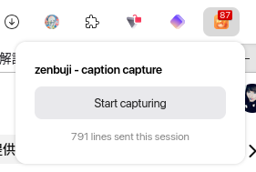
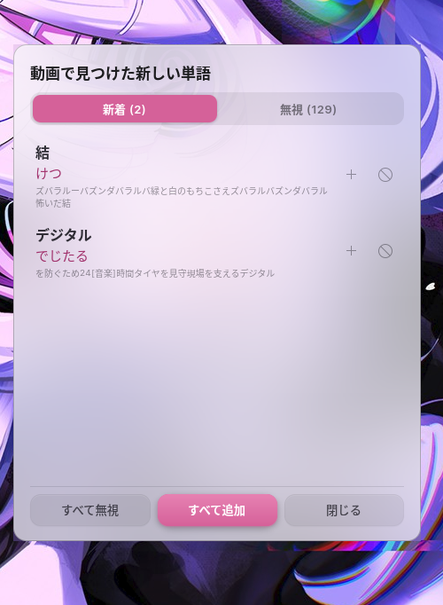
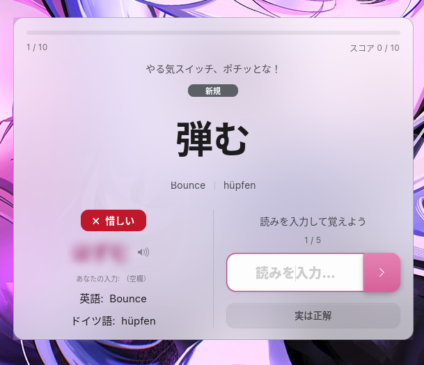
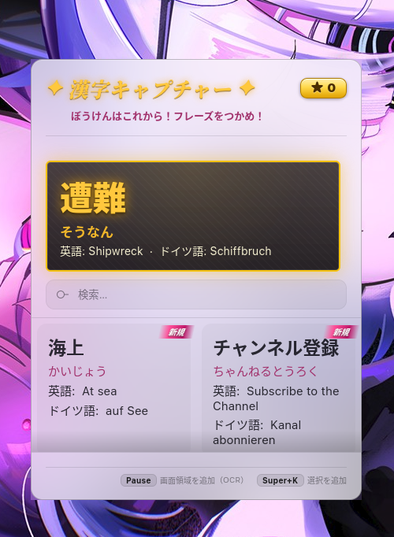

<div align="center">


# zenbuji 〜 全部字

### Read *any* Japanese on your screen — furigana + English & German — in one keypress

Hi~ I'm learning Japanese the immersion way (read and watch the stuff you love, look up what
you don't), and pausing every few seconds to paste a line into some dictionary app was
*killing* it for me. So I made zenbuji for myself: highlight any Japanese on screen, mash
`Super+J`, and the reading + meaning float up right over whatever you're in. No alt-tabbing,
no breaking immersion in the middle of an episode — and it reads text you *can't* even select,
because OCR. (｡•̀ᴗ-)✧

That's really the whole point: a lookup shouldn't yank you out of your anime / manga / VN /
whatever. You stay in it, the meaning shows up, and the words you looked up quietly become
review for later. It's just me building this — a passion project to make immersion feel less
like homework, for me and for anyone else grinding through their first 10k unknown words. ♪(´▽｀)


<sub>Furigana from real word-level analysis (not lazy kana-by-kana guessing) · translation is offline-first · everything runs on your own machine.</sub>

</div>

---

## See it in action

Highlight Japanese in any app, hit the hotkey, read it. That's the whole loop:

```text
$ zenbuji 日本語を勉強しています
日本語を勉強しています
  にほんごをべんきょうしています
  日本語（にほんご） 勉強（べんきょう）

English: I am studying Japanese.
German: Ich lerne Japanisch.
```

---

## What it does

basically the toolkit I kept wishing for while immersing:

- Select text, hit `Super+J`, and a small popup floats over whatever app you're in — no tabbing out to a separate dictionary.
- Furigana comes from real morphological analysis ([fugashi] + [unidic-lite]), so compounds and irregular readings come out right instead of a character-by-character guess that trips on 今日.
- Shows English and German side by side. Offline by default with [Argos Translate]; add a free [DeepL] key when you want the sharper output.
- OCR for text you can't select — subtitles burned into a video, a game UI, manga raws (a total lifesaver for VNs). Draw a box and it reads that too.
- Watch YouTube with the companion Firefox extension and it quietly notes the words going by in the captions; next time you open the dictionary it asks which new ones you want to keep.
- Caches every DeepL lookup into a searchable word list — a fast, scrolling card grid you can sort and filter — so repeats cost no quota and your vocab piles up on its own.
- A spaced-repetition quiz turns those saved words into recall practice, with levels as a word moves New → Learning → Young → Mature, and a retype drill that burns in the readings you keep missing. No separate Anki deck to keep up.
- A statistics window for the level breakdown, day streak, accuracy, and a 14-day activity strip; each dictionary entry shows its current level too.
- Read-aloud on every reading, with [VOICEVOX] so it's an actual voice (ずんだもん by default 💚), not cursed robo-TTS — falls back to the system voice if you skip the setup.
- The popup is a frosted-glass card that follows your accent color and light/dark theme.
- Everything runs locally — DeepL is the only optional network call — and it stays out of the way on immutable distros (Bazzite / Silverblue): no `rpm-ostree` layering.

---

## Five ways to look something up

However you bump into Japanese, there's a way to grab it:

| Surface | How | What you get |
|---|---|---|
| **Global hotkey** | Select text, press `Super+J` | Popup with furigana + EN/DE over the current app |
| **Screen OCR** | `Super+Shift+J`, draw a box | Reads text you can't select, then looks it up |
| **Top-bar menu** | Click `振`, type or paste | Inline result, recent history, quick access to everything |
| **Files menu** | Right-click a text file ▸ *Scripts ▸ zenbuji* | Looks up a whole file |
| **CLI** | `zenbuji <text>` / pipe / `--selection` | Scriptable output (incl. `--json`) |

All the language work lives in one `zenbuji` Python CLI; every surface calls it and renders
the result, so nothing drifts out of sync between them.

<div align="center">

</div>

---

## Quick start

```sh
git clone git@github.com:Meeksi39/zenbuji.git ~/zenbuji
cd ~/zenbuji
./install.sh                 # CLI + extension + Nautilus + offline backend
./install.sh --models        # ...and download the offline models now
gnome-extensions enable zenbuji@meeksi39
```

On **Wayland you have to log out and back in** for GNOME to actually load the extension
(I know, I know — Wayland moment). The hotkey (`Super+J`) works right away, no logout needed.

> **Just want the extension?** Each [release](https://github.com/Meeksi39/zenbuji/releases) ships a
> prebuilt `zenbuji@meeksi39.shell-extension.zip` —
> `gnome-extensions install zenbuji@meeksi39.shell-extension.zip --force`, then log out/in. Note
> that's the top-bar UI only; furigana/translation/OCR/practice/TTS still need the Python backend
> from `./install.sh`.

**Lighter install** (no offline backend, ~300 MB instead of ~1.7 GB of models — just use DeepL):

```sh
./install.sh --light
zenbuji config --backend deepl --deepl-key <YOUR_DEEPL_KEY>
```

`install.sh` only ever touches `~/.local/bin/{zenbuji,zb}`, the extension dir, the Nautilus
script, and a venv at `~/.local/share/zenbuji/venv`. Your config in `~/.config/zenbuji/`
is never deleted — promise. Nuke everything with `./install.sh --uninstall`.

**Requirements:** GNOME Shell 45–50 on Wayland · `python3` with PyGObject + GTK 4 (already
there on GNOME) · `wl-clipboard` for selection lookup. On Bazzite/Silverblue the system
Python is immutable, so every dep lives in the venv (made with `--system-site-packages`) —
no layering, no reboots, no tears.

---

## Features

### Screen-region OCR

A lot of on-screen Japanese just isn't selectable — text baked into a UI, a game, a video
frame, an image. Press `Super+Shift+J` (or top-bar ▸ *Look up screen region*), draw a box,
and zenbuji OCRs it and gives you furigana + EN/DE. It shows the captured image for
reference and drops the recognized text into an editable field — OCR isn't psychic, so if it
grabs a stray character, fix it and press Enter to look it up again.

<div align="center">

</div>

OCR is [manga-ocr] (a lovely Japanese-tuned model) running **fully offline**. It needs the
full install (not `--light`) and grabs a ~450 MB model on first use; the very first lookup
takes a few seconds while the model wakes up (the popup shows a spinner). Capture goes
through the desktop Screenshot portal, so it's happy on Wayland.

```sh
zenbuji ocr                  # capture a region interactively
zenbuji ocr image.png        # or OCR a file you already have
```

### Personal dictionary

With the DeepL backend active, every translation is cached to
`~/.local/share/zenbuji/dictionary.json`. Repeat lookups come straight from the cache, which
is faster and protects your free-tier quota, and over time it adds up to a personal word
list. Each entry tracks how often you've looked it up and when you first and last saw it.

Browse it in the dictionary window (the dictionary button in the popup, the top-bar menu, or
`zenbuji dict`): a card grid that fans out into more columns as you widen the window, with a
search box, a sort dropdown (newest, oldest, most-looked-up, A→Z), and filter tabs for All /
Review / Untranslated / Excluded. On each card you can delete an entry, clear all, re-translate,
or pop a word back open in the lookup popup. It shows your remaining DeepL quota when a key is
set. Once a word enters practice, its card also shows its SRS level badge, next-due date, and
correct/wrong tally, and a Statistics button opens the full learning overview. The list is
virtualized, so it stays smooth even at tens of thousands of words.

The window refreshes live, so words you grab with the background OCR-add shortcut
(`Super+Shift+K`) pop in while it's open on a second monitor — handy mid-game. You can fix a
translation in place (the edit button on a row), and exclude a word from practice (the
exclude toggle) when you don't want it in the quiz.

<div align="center">

</div>

### Caption capture (YouTube → your word list)

So much immersion happens on YouTube, and I didn't want to pause and re-type every word I half-knew.
There's a little companion **Firefox extension** that rides along on YouTube and quietly logs the
words scrolling past in the captions — it doesn't translate or interrupt anything, just stashes them.
Hit *Start capturing* once and it ticks along in the background (it'll tell you how many lines it's
sent this session).

<div align="center">

</div>

Then, next time you open the dictionary, a review window pops up: *"new words found in the video."*
You skim the new ones (each shows the line it appeared in for context), tap ＋ to keep the ones you
care about or ⊘ to ignore the rest — or *Add all* / *Ignore all* in one go. Kept words go straight
into your dictionary and practice; ignored ones never bug you again.

<div align="center">

</div>

It filters out the obvious noise (katakana-only loanwords are optionally hidden, particles and junk
dropped) so the list is words actually worth learning. The extension just feeds the words to the
zenbuji backend over native messaging — works in regular Firefox and Flatpak Firefox alike. Grab it
from `firefox/zenbuji-capture/` (load it as a temporary add-on, or zip + install).

### Practice (spaced repetition)

Take the words you've already met and turn them into actual recall. Practice
(`zenbuji learn`, the `Super+Shift+L` hotkey, or the top-bar menu) shows a word as big plain
kanji with no furigana; you type the reading (and the translation, unless it's shown as a
hint), then the answer is revealed and graded — the reading exactly, the translation fuzzily
against EN or DE, with a self-grade override (✓/✗) for when your wording was basically right.

<div align="center">

| Type the reading… | …get graded, then drill it | …retype from memory |
|:---:|:---:|:---:|
|  |  |  |

</div>

Results feed an SM-2-style schedule in `~/.local/share/zenbuji/srs.json`: nail it and the
next review drifts further out (New → Learning → Young → Mature), whiff it and the word
comes right back to haunt you. Each round pulls the most-due/new words (10 by default) and
ends with a little summary.

**Miss a reading and you don't just move on** — there's a retype drill that burns it in (on by
default; `--learn-drill-repeats`). The correct reading shows, you retype it a few times, and each
correct retype is read aloud and blurs the furigana out so the rest are from memory; slip and it
flashes back clearly. Clear the whole drill and a sword-slash + a "Drill done!!" ribbon flies in to
cap it off. (No drill? You get the classic Got it / Missed buttons instead, with the default
following your reading, and an "I was right" escape for an over-strict grade.)

Little **sound effects** mark how it's going — a soft chime when you nail a reading, a buzz when you
miss, the slash on a finished drill (`zenbuji config --sfx off` to silence them). The correct reading
is read aloud too (right or wrong) if you've got auto-read on. And every round opens with a random
casual greeting from ずんだもん — cute, silly, or a little bit cursed — and waves you off with a
matching goodbye at the end. Switch it off if it's not your thing.

Each card shows its current level as you go, and the end-of-round summary tells you how many
words graduated to the next one.

### Statistics

See how the learning is actually going. Statistics (`zenbuji stats`, the top-bar menu, the
Statistics button in the dictionary, or View stats on a finished round) opens a frosted-glass
overview: how many words sit at each level, how many are due today, your overall accuracy and
day streak, a 14-day activity strip, and the words you miss the most. The streak and activity
graph build up from your daily reviews (logged to `~/.local/share/zenbuji/activity.json`).

- `--learn-show-translation on|off` — show the meaning as a hint (test only the reading) vs. hide it (test reading **and** translation)
- `--learn-on-login on|off` — auto-open a round once a day on login (off by default — opt in if you want the daily nudge)
- `--learn-greeting on|off` — the random opening greeting (on by default)

### Game helper — 漢字キャプチャー

`zenbuji game` (`Super+Shift+G`, or the top-bar menu) opens 漢字キャプチャー ("Kanji Capture").
It's the same dictionary, just as a calmer overlay you can leave on a second monitor while you
play — so you can grab a word out of a game without a popup yanking focus away from it. I gave
it a little game-inspired look because studying mid-game should feel a bit fun: a big-kanji hero
card for the word you just grabbed, a running score, a friendly ずんだもん line, your add
shortcuts, and a live grid of recent words (same cards as the dictionary, ribbon-tagged 新規 for a
brand-new word or レベルアップ for one you've seen before). The extension also keeps zenbuji off
your fullscreen game's display.

<div align="center">

</div>

Banking a word is a tiny hit of dopamine on purpose — a new word lands with a sword-slash, an
energetic 新規ゲット！ shout from a punchy voice, and a ribbon flying in over the hero card. Score
ticks up **+500 for a brand-new word, +100 for one you already knew**, so the count actually means
something.

Two silent, no-popup ways to bank a word while you play (both read it aloud, neither steals focus):

- `Super+Shift+K` — capture a screen region and add it (OCR).
- `Super+K` — add the current text selection.

### Hear it spoken

Every reading gets a read-aloud button — in the popup, next to each dictionary entry, and on
the quiz answer screen — so you actually hear the pronunciation instead of squinting at kana.

For natural Japanese (instead of the cursed robotic system voice), zenbuji leans on
[VOICEVOX], a free local neural TTS engine. One step to set it up:

```sh
./install.sh --voicevox   # pulls the engine (rootless podman) and runs it as a user service
```

Then pick a voice in Settings ▸ Speech (default: my beloved ずんだもん / Zundamon — 100+ to
choose from) and hit Test. No VOICEVOX? zenbuji quietly falls back to `spd-say`/`espeak-ng`.
Engine and voice are configurable:
`zenbuji config --tts-engine voicevox --voicevox-speaker 3`, list voices with
`zenbuji voices`, or wire up any command you like with `--tts-command '… {text}'`.

The extension makes sure the engine is running when you log in, and there's a Start VOICEVOX
item in the top-bar menu (plus `zenbuji voicevox start`) for when you need to kick it manually.

<div align="center">


<em>Learn with ずんだもん！(◕ᴗ◕✿)</em>

</div>

Press `Super+Shift+S` to read the current selection aloud with no popup at all. Turn on
"Read aloud after a lookup" (Settings ▸ Speech, or `zenbuji config --tts-on-lookup on`) and
`Super+J` speaks the reading automatically every time — handy for shadowing.

### Frosted-glass popup

The popup is a headerless, translucent floating card that follows your light/dark theme and
system accent color, can be dragged from any empty spot, and dismisses on Escape (and
optionally when it loses focus). Every reading and translation has a copy button.

GNOME/Mutter can't blur behind an app's own window, so the real blur comes from
[Blur My Shell] — `install.sh` adds `com.meeksi39.zenbuji` to its Applications whitelist
automatically (idempotent, removed on uninstall). It looks best with Applications blur on,
static blur off, hacks level 1+. Without Blur My Shell it degrades gracefully to a clean
translucent panel.

---

## Usage (CLI)

```sh
zenbuji 日本語を勉強しています   # furigana + EN + DE
zenbuji furigana 今日は良い天気    # readings only
zenbuji tr これは何ですか          # translation only
zenbuji --selection               # process the current text selection
echo "ありがとう" | zenbuji        # from stdin
zenbuji --json 速い               # machine-readable output
zenbuji popup 速い                # GTK popup window
zenbuji ocr                       # capture a screen region and OCR it
zenbuji dict                      # open the local dictionary window
zenbuji learn                     # spaced-repetition practice over the cache
zenbuji stats                     # learning statistics (add --json for scripting)
zenbuji speak こんにちは            # read text aloud (VOICEVOX / system voice)
zenbuji voices                    # list available VOICEVOX speakers
zenbuji voicevox start            # start the local VOICEVOX engine (stop/restart/status too)
```

`zb` is a short alias for `zenbuji` (for when typing eight whole characters is too much).

### Re-binding the hotkey

`install.sh` registers `Super+J` as a GNOME *custom keyboard shortcut* running
`zenbuji popup --selection` (works even without the extension). Re-bind it under **Settings ▸
Keyboard ▸ Custom Shortcuts**, in the extension settings, or with gsettings:

```sh
P=org.gnome.settings-daemon.plugins.media-keys.custom-keybinding:/org/gnome/settings-daemon/plugins/media-keys/custom-keybindings/zenbuji/
gsettings set "$P" binding '<Super>F9'
```

### Configuration

Easiest path is the **extension settings UI** (`gnome-extensions prefs zenbuji@meeksi39`, or
*Extensions ▸ zenbuji ▸ Settings*): set the DeepL key, pick the backend and languages, choose
the interface language (English or 日本語), verify the key (shows remaining quota), toggle the
history, flip the popup's close-on-focus-loss, and rebind the hotkeys. It reads and writes the
same config file the CLI uses, so every surface stays in lockstep.

<div align="center">

| Translation & languages | Shortcuts & behaviour |
|:---:|:---:|
|  |  |

</div>

<details>
<summary><strong>Configure from the command line</strong></summary>

```sh
zenbuji config                          # show current config
zenbuji config --backend argos          # offline (default)
zenbuji config --backend deepl --deepl-key <KEY>
zenbuji config --lang en,de             # which languages to show
zenbuji config --ui-language ja         # interface language (en or ja)
zenbuji config --popup-close-on-focus-loss off   # keep popup open until Escape
zenbuji config --dictionary off         # stop caching DeepL translations
zenbuji config --translation-char-limit 200   # max characters per lookup
zenbuji config --learn-show-translation off   # quiz reading AND translation
zenbuji config --learn-on-login on      # open a practice round once a day on login
zenbuji config --learn-greeting off     # turn off the random opening greeting
zenbuji config --learn-drill-repeats 5  # retype a missed reading N times (0 = off)
zenbuji config --sfx off                # mute the quiz/game sound effects
zenbuji config --tts-engine voicevox    # auto | voicevox | system | command | off
zenbuji config --voicevox-speaker 3     # voice id (see: zenbuji voices)
zenbuji config --tts-speed 0.9          # speaking rate, 1.0 = normal (0.5–2.0)
zenbuji config --tts on                 # read words aloud after an OCR/silent add
zenbuji config --tts-on-lookup on       # auto-read the reading after a popup lookup
zenbuji config --tts-add-translation on # OCR add also speaks the English meaning (英語で…)
zenbuji config --history off            # stop recording recent lookups
zenbuji config --clear-history          # forget recorded lookups
zenbuji usage                           # check the DeepL key + remaining quota
```

Config lives in `~/.config/zenbuji/config.json`. The DeepL key can also come from
`$DEEPL_API_KEY`. `auto` (the default) uses DeepL when a key is set, otherwise the offline
backend. Recent lookups are in `~/.local/share/zenbuji/history.json`.

</details>

### Offline models

```sh
zenbuji models --install   # download ja↔en, en↔de packages
zenbuji models --list      # show installed language packs
```

German pivots through English (ja→en→de) when there's no direct model — DeepL gives nicer
German if you've got a key.

---

## Why I made this

Okay so — I'm learning Japanese, and I got *so* tired of pausing every five seconds to copy
some text into a separate dictionary app just to read one kanji. I wanted readings + meaning
for *anything* on screen, instantly, without ever breaking immersion — subtitles, a web page,
a chat message, a visual novel, whatever. So I built the thing I wished existed: furigana and
an EN/DE gloss one keypress away, anywhere in the OS. 勉強, but make it painless ‹3

But it's bigger than me being impatient, honestly. So much of learning Japanese is stuck
behind paid apps, fiddly setups, and walled gardens — and I think that's silly. Immersion
should be something *anyone* can just do: free, offline, on your own machine, nobody
gatekeeping it. That's the little dream zenbuji is chipping away at. 一緒にがんばろう〜 ✊

> Built for my own Bazzite (Fedora Silverblue) / GNOME Wayland setup first. Free to use and
> remix for your own rig — **just credit me** (Meeksi39) and we're good (｀・ω・´)ゞ

## Development

The repo is the source of truth; `install.sh` symlinks the extension and points the CLI
launcher at `bin/zenbuji_main.py`, so edits take effect immediately (reload GNOME Shell / log out
on Wayland for extension changes). Tail the extension logs while you hack:

```sh
journalctl -f -o cat /usr/bin/gnome-shell
```

**Tests.** The engine logic (SRS scheduling, the activity log, answer grading,
the dictionary cache + caching contract, the translation-backend dispatch, and
the statistics aggregation), plus end-to-end CLI smoke tests, is covered by a
pytest suite that needs no GTK or display. Network calls are mocked and every
CLI test runs in an isolated temp `HOME`/XDG so it never touches real user data:

```sh
pytest                       # run the suite
python -m compileall bin     # syntax-check every module
```

There are also **GUI smoke tests** that launch each window and assert it renders
without crashing — they need a display, so run them locally or under `xvfb`:

```sh
xvfb-run -a pytest                 # includes the GUI smoke tests
```

GitHub Actions (`.github/workflows/ci.yml`) runs a fast dependency-light gate
plus a full job that installs GTK4/libadwaita and runs everything under `xvfb`
with coverage measured across the in-process tests *and* the CLI/GUI
subprocesses they spawn. The compile step also guards against non-ASCII sneaking
into the CSS string.

The UI has a deliberate visual language (frosted-glass cards, the accent color,
pill controls, cairo charts). Before adding or restyling a surface, read
**[docs/STYLE.md](docs/STYLE.md)** — it documents the design system, the shared
CSS classes, and the GTK gotchas so new windows match the rest.

---

## Credits

zenbuji stands on a whole pile of other people's hard work — go show them some love:

- **Logo & mascot art** by **[Aimy Gwen]** — she drew **Zenbu-chan**, the friendly 全部字 face that fronts the whole project. ♡
- **[VOICEVOX]** — the local neural TTS engine, with **ずんだもん (Zundamon)** as the default voice. Per the VOICEVOX terms, synthesized speech is credited as **`VOICEVOX:ずんだもん`**; if you switch voices, credit that voice provider instead.
- **[fugashi] + [unidic-lite]** — MeCab-powered morphological analysis, aka the reason the furigana is actually *correct* and not vibes-based.
- **[Argos Translate]** — offline neural translation · **[DeepL]** — the optional online backend when you want it crisper.
- **[manga-ocr]** — the Japanese-tuned OCR model that reads text right off your screen.
- **[Blur My Shell]** — supplies the real frosted-glass blur behind the popup.
- **GTK 4 / libadwaita / PyGObject / GNOME Shell** — the toolkit and platform it all rides on. Plus `jaconv`, `speech-dispatcher` / `espeak-ng` for fallback TTS, and `podman` for running VOICEVOX.

And full honesty: **a good chunk of this was coded with AI** (Claude / Claude Code) riding
shotgun. I drove and made the calls, it typed a lot of the boilerplate — the bugs are still
mine to answer for though (´･ω･`)

---

[Aimy Gwen]: https://aimygwen.art/
[fugashi]: https://github.com/polm/fugashi
[unidic-lite]: https://github.com/polm/unidic-lite
[Argos Translate]: https://github.com/argosopentech/argos-translate
[manga-ocr]: https://github.com/kha-white/manga-ocr
[DeepL]: https://www.deepl.com/pro-api
[Blur My Shell]: https://extensions.gnome.org/extension/3193/blur-my-shell/
[VOICEVOX]: https://voicevox.hiroshiba.jp/
