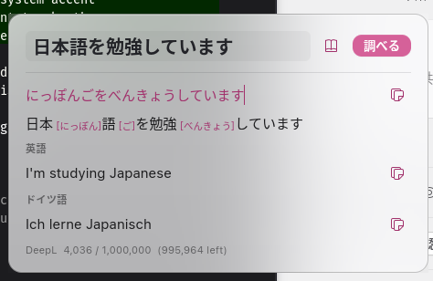

<div align="center">

# zenbuji 〜 全部字

### Read *any* Japanese on your screen — furigana + English & German — in one keypress.

**Select text anywhere, press `Super+J`, and get the readings and the meaning instantly.**
No copy-pasting into a dictionary app. No leaving what you're doing. Works in your
browser, your editor, a chat window — and even on text you *can't* select, via screen OCR.



<sub>Furigana is real word-level analysis (not naïve kana mapping) · translation is offline-first · the whole thing runs on your machine.</sub>

</div>

---

## See it in action

Select Japanese in **any** app, press the hotkey, read it. That's the whole loop:

<video src="https://github.com/Meeksi39/zenbuji/raw/main/docs/demo-selection-lookup.webm" controls muted width="720"></video>

> *Video not playing? [Watch demo-selection-lookup.webm](docs/demo-selection-lookup.webm).*

```text
$ zenbuji 日本語を勉強しています
日本語を勉強しています
  にほんごをべんきょうしています
  日本語（にほんご） 勉強（べんきょう）

English: I am studying Japanese.
German: Ich lerne Japanisch.
```

---

## Why zenbuji?

- 🟣 **One keypress, anywhere.** A GNOME global shortcut reads your current selection and shows a popup over whatever you're looking at. No app-switching, no breaking immersion.
- 🔤 **Furigana that's actually correct.** Readings come from real morphological analysis ([fugashi] + [unidic-lite]), so compounds and irregular readings are right — not a character-by-character guess.
- 🌍 **English *and* German, side by side.** Offline-first with [Argos Translate]; plug in a free [DeepL] key for sharper translations when you want them.
- 👁️ **OCR for unselectable text.** Subtitles, a game, a UI label, an image — draw a box and zenbuji reads it.
- 📖 **Builds your personal dictionary.** Every DeepL lookup is cached into a searchable word list, so you stop re-spending quota and start seeing your progress.
- 🎴 **Turns words into practice.** A built-in spaced-repetition quiz drills the words you've already looked up.
- 🔊 **Hear every word.** A read-aloud button on every reading, with first-class [VOICEVOX] support for natural Japanese neural voices (falls back to the system voice).
- 🪟 **Polished, native feel.** A frosted-glass popup that follows your accent color and light/dark theme.
- 🔒 **Yours, offline, private.** All processing is local (DeepL is the only optional network call). Runs on immutable distros (Bazzite / Silverblue) with no `rpm-ostree` layering.

---

## Five ways to look something up

zenbuji meets you wherever the text is:

| Surface | How | What you get |
|---|---|---|
| ⌨️ **Global hotkey** | Select text, press `Super+J` | Popup with furigana + EN/DE over the current app |
| 👁️ **Screen OCR** | `Super+Shift+J`, draw a box | Reads text you can't select, then looks it up |
| 🔼 **Top-bar menu** | Click `振`, type or paste | Inline result, recent history, quick access to everything |
| 📁 **Files menu** | Right-click a text file ▸ *Scripts ▸ zenbuji* | Looks up a whole file |
| 💻 **CLI** | `zenbuji <text>` / pipe / `--selection` | Scriptable output (incl. `--json`) |

All the language processing lives in one `zenbuji` Python CLI — every surface just calls it and renders the result, so they always stay in sync.

<div align="center">

</div>

---

## Quick start

```sh
git clone git@github.com:Meeksi39/zenbuji.git ~/zenbuji
cd ~/zenbuji
./install.sh                 # CLI + extension + Nautilus + offline backend
./install.sh --models        # ...and download the offline models now
gnome-extensions enable zenbuji@meeksi39
```

On **Wayland you must log out and back in** for GNOME to load the extension.
The hotkey (`Super+J`) works immediately, no logout needed.

**Lighter install** (no offline backend, ~300 MB — use DeepL instead of ~1.7 GB of models):

```sh
./install.sh --light
zenbuji config --backend deepl --deepl-key <YOUR_DEEPL_KEY>
```

`install.sh` only ever touches `~/.local/bin/{zenbuji,zb}`, the extension dir, the
Nautilus script, and a venv at `~/.local/share/zenbuji/venv`. Your config in
`~/.config/zenbuji/` is never deleted. Remove everything with `./install.sh --uninstall`.

**Requirements:** GNOME Shell 45–50 on Wayland · `python3` with PyGObject + GTK 4
(standard on GNOME) · `wl-clipboard` for selection lookup. On Bazzite/Silverblue the
system Python is immutable, so all deps go in the venv (created with
`--system-site-packages`) — no layering, no reboot.

---

## Features

### 👁️ Screen-region OCR

Lots of Japanese on screen isn't selectable — text baked into a UI, a game, a video
frame, an image. Press **`Super+Shift+J`** (or top-bar ▸ *Look up screen region*),
**draw a box**, and zenbuji reads it with OCR, then shows furigana + EN/DE. The captured
image is shown for reference and the recognized text sits in an **editable field** — OCR
isn't perfect, so fix a stray character and press Enter to look it up again.

<div align="center">

</div>

OCR is [manga-ocr] (a Japanese-tuned model) running **fully offline**. It needs the full
install (not `--light`) and downloads a ~450 MB model on first use; the first lookup takes
a few seconds while the model loads (the popup shows a spinner). Capture goes through the
desktop Screenshot portal, so it works on Wayland.

```sh
zenbuji ocr                  # capture a region interactively
zenbuji ocr image.png        # or OCR a file you already have
```

### 📖 Personal dictionary

When the **DeepL** backend is active, every translation is cached to
`~/.local/share/zenbuji/dictionary.json`. Repeat lookups are served from the cache — faster,
and it preserves your free-tier quota — while building up a personal word list. Each entry
records how often you've looked it up and the first/last time, so you can watch your progress.

Browse it in the **Dictionary window** (the 📖 icon in the popup, the top-bar menu, or
`zenbuji dict`): search, delete an entry, clear all, re-translate, or re-open a word in the
lookup popup. The popup also shows your remaining DeepL quota when a key is set.

<div align="center">


<video src="https://github.com/Meeksi39/zenbuji/raw/main/docs/demo-dictionary.webm" controls muted width="640"></video>

<sub><em>Video not playing? <a href="docs/demo-dictionary.webm">Watch demo-dictionary.webm</a>.</em></sub>
</div>

### 🎴 Practice (spaced repetition)

Turn the words you've looked up into active recall. **Practice** (`zenbuji learn`, the
**`Super+Shift+L`** hotkey, or the top-bar menu) shows a word as **large kanji** with no
furigana; you type the **reading** (and the **translation**, unless it's shown as a hint),
and the answer is revealed and graded — the reading exactly, the translation fuzzily (EN or
DE) with a self-grade override (✓/✗) when the wording differs.

<div align="center">

| Type the reading… | …and get graded |
|:---:|:---:|
|  |  |

<video src="https://github.com/Meeksi39/zenbuji/raw/main/docs/demo-practice.webm" controls muted width="640"></video>

<sub><em>Video not playing? <a href="docs/demo-practice.webm">Watch demo-practice.webm</a> · <a href="docs/demo-practice-flashcards.webm">flashcard variant</a>.</em></sub>
</div>

Results drive an SM-2-style schedule in `~/.local/share/zenbuji/srs.json`: correct answers
push the next review further out (New → Learning → Young → Mature), wrong answers bring it
back. Each round picks the most-due/new words (10 by default) and ends with a summary.

- `--learn-show-translation on|off` — show the meaning as a hint (test only the reading) vs. hide it (test reading **and** translation)
- `--learn-on-login on|off` — open a round automatically, at most once a day, on login (off by default)

### 🔊 Hear it spoken

Every reading has a **🔊 read-aloud button** — in the popup, beside each dictionary
entry, and on the quiz answer screen — so you hear the pronunciation, not just see it.

For natural Japanese (rather than the robotic system voice), zenbuji has first-class
support for **[VOICEVOX]**, a free local neural TTS engine. Set it up in one step:

```sh
./install.sh --voicevox   # pulls the engine (rootless podman), runs it as a user service
```

Then pick a voice in **Settings ▸ Speech** (default: ずんだもん / Zundamon — 100+ voices
available) and hit **Test**. Without VOICEVOX, zenbuji falls back to `spd-say`/`espeak-ng`.
Engine and voice are configurable: `zenbuji config --tts-engine voicevox --voicevox-speaker 3`,
list voices with `zenbuji voices`, or wire any command with `--tts-command '… {text}'`.

Press **`Super+Shift+S`** to read the current selection aloud without a popup. Turn on
**Read aloud after a lookup** (Settings ▸ Speech, or `zenbuji config --tts-on-lookup on`)
to have `Super+J` speak the reading automatically every time you look something up.

### 🪟 Frosted-glass popup

The popup is a headerless, translucent floating card that follows your system light/dark
theme and **system accent color**, can be **dragged** from any empty spot, and dismisses on
**Escape** (and optionally when it loses focus). Each reading and translation has a **copy
button**.

GNOME/Mutter can't blur behind an app's own window, so the real blur is supplied by
[Blur My Shell] — `install.sh` adds `com.meeksi39.zenbuji` to its **Applications ▸ whitelist**
automatically (idempotent; removed on uninstall). For the best effect: Applications blur
**on**, static blur **off**, hacks level **1+**. Without Blur My Shell the popup degrades
gracefully to a clean translucent panel.

---

## Usage (CLI)

```sh
zenbuji 日本語を勉強しています   # furigana + EN + DE
zenbuji furigana 今日は良い天気    # readings only
zenbuji tr これは何ですか          # translation only
zenbuji --selection               # process the current text selection
echo "ありがとう" | zenbuji        # from stdin
zenbuji --json 速い               # machine-readable output
zenbuji popup 速い                # GTK popup window
zenbuji ocr                       # capture a screen region and OCR it
zenbuji dict                      # open the local dictionary window
zenbuji learn                     # spaced-repetition practice over the cache
zenbuji speak こんにちは            # read text aloud (VOICEVOX / system voice)
zenbuji voices                    # list available VOICEVOX speakers
```

`zb` is a short alias for `zenbuji`.

### Re-binding the hotkey

`install.sh` registers `Super+J` as a GNOME *custom keyboard shortcut* running
`zenbuji popup --selection` (works without the extension). Re-bind it under **Settings ▸
Keyboard ▸ Custom Shortcuts**, in the extension settings, or with gsettings:

```sh
P=org.gnome.settings-daemon.plugins.media-keys.custom-keybinding:/org/gnome/settings-daemon/plugins/media-keys/custom-keybindings/zenbuji/
gsettings set "$P" binding '<Super>F9'
```

### Configuration

The easiest way is the **extension settings UI** (`gnome-extensions prefs zenbuji@meeksi39`,
or *Extensions ▸ zenbuji ▸ Settings*): set the DeepL key, pick the backend and languages,
choose the interface language (English or 日本語), verify the key (shows remaining quota),
toggle the history, flip the popup's close-on-focus-loss, and rebind the hotkeys. It reads
and writes the same config file the CLI uses, so every surface stays in sync.

<div align="center">

| Translation & languages | Shortcuts & behaviour |
|:---:|:---:|
|  |  |

</div>

<details>
<summary><strong>Configure from the command line</strong></summary>

```sh
zenbuji config                          # show current config
zenbuji config --backend argos          # offline (default)
zenbuji config --backend deepl --deepl-key <KEY>
zenbuji config --lang en,de             # which languages to show
zenbuji config --ui-language ja         # interface language (en or ja)
zenbuji config --popup-close-on-focus-loss off   # keep popup open until Escape
zenbuji config --dictionary off         # stop caching DeepL translations
zenbuji config --translation-char-limit 200   # max characters per lookup
zenbuji config --learn-show-translation off   # quiz reading AND translation
zenbuji config --learn-on-login on      # open a practice round once a day on login
zenbuji config --tts-engine voicevox    # auto | voicevox | system | command | off
zenbuji config --voicevox-speaker 3     # voice id (see: zenbuji voices)
zenbuji config --tts-speed 0.9          # speaking rate, 1.0 = normal (0.5–2.0)
zenbuji config --tts on                 # read words aloud after an OCR/silent add
zenbuji config --tts-on-lookup on       # auto-read the reading after a popup lookup
zenbuji config --tts-add-translation on # OCR add also speaks the English meaning (英語で…)
zenbuji config --history off            # stop recording recent lookups
zenbuji config --clear-history          # forget recorded lookups
zenbuji usage                           # check the DeepL key + remaining quota
```

Config lives in `~/.config/zenbuji/config.json`. The DeepL key can also come from
`$DEEPL_API_KEY`. `auto` (the default) uses DeepL when a key is set, otherwise the offline
backend. Recent lookups are in `~/.local/share/zenbuji/history.json`.

</details>

### Offline models

```sh
zenbuji models --install   # download ja↔en, en↔de packages
zenbuji models --list      # show installed language packs
```

German is produced by pivoting through English (ja→en→de) when no direct model exists —
DeepL gives better German if you have a key.

---

## Motivation

I'm learning Japanese and wanted a reading + meaning for *anything* on screen without
breaking immersion — subtitles, a web page, a chat message — instead of copying text into a
separate dictionary app every time. zenbuji puts furigana and an EN/DE gloss one keypress
away, anywhere in the OS.

> Built for my own Bazzite (Fedora Silverblue) / GNOME Wayland system first. Free to use and
> adapt for your own setup — **just mention me** (Meeksi39).

## Development

The repo is the source of truth; `install.sh` symlinks the extension and points the CLI
launcher at `bin/zenbuji.py`, so edits take effect immediately (reload GNOME Shell / log out
on Wayland for extension changes). Watch extension logs:

```sh
journalctl -f -o cat /usr/bin/gnome-shell
```

---

[fugashi]: https://github.com/polm/fugashi
[unidic-lite]: https://github.com/polm/unidic-lite
[Argos Translate]: https://github.com/argosopentech/argos-translate
[manga-ocr]: https://github.com/kha-white/manga-ocr
[DeepL]: https://www.deepl.com/pro-api
[Blur My Shell]: https://extensions.gnome.org/extension/3193/blur-my-shell/
[VOICEVOX]: https://voicevox.hiroshiba.jp/
